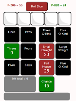

# Fresh Dice
   
## Two Player Poker Dice Game.
This two-player game leverages WebRTC-DataChannel and Deno-Deploy BroadcastChannel.
SEE: https://github.com/nhrones/comms
# fresh project
 
The fun thing about the multiplayer game is that players are allowed    
to 'steal' other players score items if they roll a greater sum for that item.    

[]()
   
### Usage:
```
Open one or two instances of the app. 
Each instance will show a unique color icon in the tab.
This color will match the color of the `Roll-Button` to determin whos turn it is.

Click the 'Roll Button' to start.    
After each roll of the dice, you can 'click' a die to 'freeze' its value.    
Click again to toggle the frozen state.  
After three rolls, you must select a score item.    
The blue highlighted numbers indicate possible scores that are available to select.
You may steal any other players score-item if a blue score is shown.
Have fun!
```
### NOTE:
Try it on Deploy
```
https://fresh-dice.deno.dev/
```